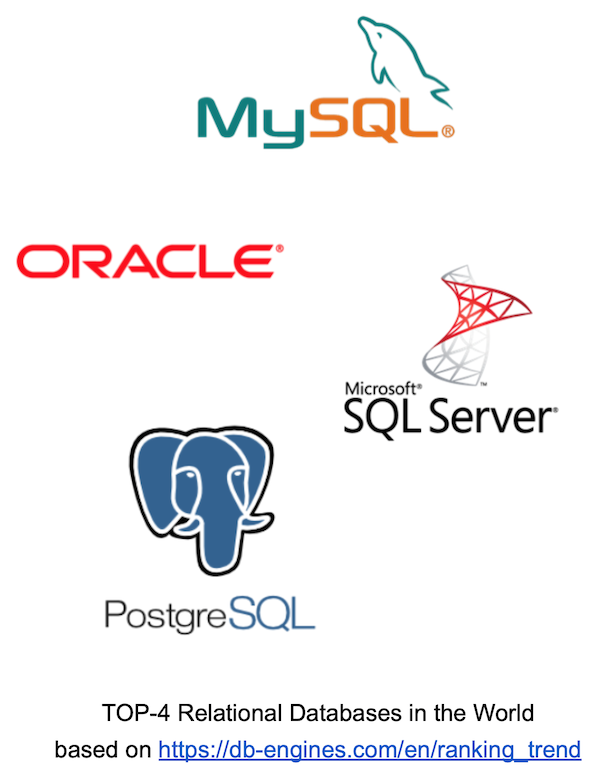
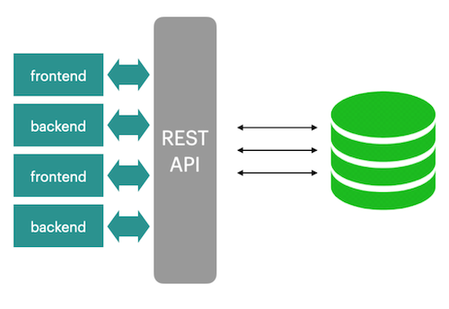
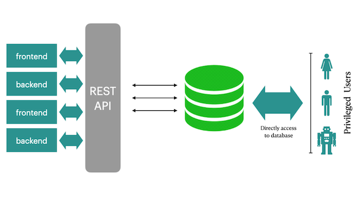

## _RDBMS is not just a tables_

В этом проекте ты освоишь создание функций (SQL/PLpgSQL) и триггеров для реализации бизнес-логики на уровне СУБД, научишься разрабатывать систему аудита изменений данных и оптимизировать запросы.

Эти навыки пригодятся в backend-разработке, анализе данных и проектировании высоконагруженных систем, где требуется обеспечение целостности данных, отслеживание изменений и перенос логики в базу данных для повышения производительности.

💡 [Нажми сюда](https://new.oprosso.net/p/4cb31ec3f47a4596bc758ea1861fb624), **чтобы поделиться с нами обратной связью на этот проект**. Это анонимно и поможет нашей команде сделать обучение лучше. Рекомендуем заполнить опрос сразу после выполнения проекта.

## Содержание

- [Как учиться в «Школе 21»](#как-учиться-в-школе-21)
- [Chapter I](#chapter-i)
- [Введение](#введение)
- [Chapter II](#chapter-ii)
- [Рекомендации к выполнению этого проекта](#рекомендации-к-выполнению-этого-проекта)
- [Chapter III](#chapter-iii)
- [Задание 00 — Audit of incoming inserts](#задание-00-audit-of-incoming-inserts)
- [Задание 01 — Audit of incoming updates](#задание-01-audit-of-incoming-updates)
- [Задание 02 — Audit of incoming deletes](#задание-02-audit-of-incoming-deletes)
- [Задание 03 — Generic Audit](#задание-03-generic-audit)
- [Задание 04 — Database View VS Database Function](#задание-04-database-view-vs-database-function)
- [Задание 05 — Parameterized Database Function](#задание-05-parameterized-database-function)
- [Задание 06 — Function like a function-wrapper](#задание-06-function-like-a-function-wrapper)
- [Задание 07 — Different view to find a Minimum](#задание-07-different-view-to-find-a-minimum)
- [Задание 08 — Fibonacci algorithm is in a function](#задание-08-fibonacci-algorithm-is-in-a-function)

## Как учиться в «Школе 21»

- Здесь тебя ждет уникальный образовательный опыт с большим количеством свободы. Ты получаешь задачу и самостоятельно ищешь пути решения, используя любые удобные способы поиска информации — ресурсы Интернета или нейросети (например, GigaChat). Но внимательно относись к качеству информации: проверяй, думай, анализируй, сравнивай.
- Взаимообучение (Peer-to-Peer, P2P) — это обмен знаниями и опытом с другими пирами, где каждый выступает и учителем, и учеником. Такой подход позволяет глубже понять материал, учась друг у друга.
- Чувствуй себя свободно и проси о помощи — вокруг тебя те, кто тоже впервые проходят этот путь. Делись своим опытом и идеями с другими. Присоединяйся к Rocket.Chat, чтобы быть в курсе всех новостей от нашего сообщества.
- Твое обучение не будет иметь никакого смысла, если ты будешь копировать чужие решения. Если пользуешься помощью других — всегда разбирайся до конца, почему, как и зачем. Не бойся ошибиться.
- Кажется, что задача невыполнима? Сделай перерыв, проветрись, перезагрузи голову — это помогало многим. Возможно, после этого решение придет само собой.
- Важен не только результат обучения, но и сам процесс. Нужно не просто решить задачу, а понять, КАК ее решить.

Как работать с проектом:

- Перед выполнением проект необходимо склонировать с GitLab в одноименный репозиторий.
- Все файлы необходимо создавать в папке _src/_ склонированного репозитория.
- После клонирования проекта необходимо создать ветку _develop_ и вести разработку в ней. После этого пушить в GitLab также нужно ветку _develop_.
- В твоей директории не должно быть иных файлов, кроме тех, что обозначены в заданиях.

## Chapter I
## Введение

В мире реляционных СУБД существует множество функциональных языков программирования. В основном можно говорить о взаимно-однозначном соответствии между конкретным движком СУБД и встроенным в него функциональным языком. Ознакомьтесь с примерами таких языков:

- T-SQL,
- PL/SQL,
- SQL,
- PL/PGSQL,
- PL/R,
- PL/Python и другие.

В IT-сообществе существуют две противоположные точки зрения о размещении бизнес-логики.  
Первая предлагает размещать ее на уровне приложения, вторая - непосредственно в СУБД с использованием наборных пользовательских функций (UDF), хранимых процедур и пакетов. Каждый выбирает свой собственный путь реализации бизнес-логики.  
Есть мнение, что бизнес-логика должна находиться в обоих местах, и вот почему:

Ознакомься с двумя простыми архитектурами, представленными ниже.

|  |  |
| ------ | ------ |
|  | Все понятно: фронтенды и бэкенды взаимодействуют через специальный слой REST API, в котором реализована вся бизнес-логика. Это действительно идеальный мир приложений. | 
| Однако всегда находятся привилегированные пользователи или приложения (например, IDE), которые работают с базами данных напрямую, что может нарушить нашу архитектурную модель. |  |

Просто помни про это, когда будешь создавать чистую архитектуру. :-)

## Chapter II
## Рекомендации к выполнению этого проекта

- Убедись, что ты работаешь с последней версией PostgreSQL.
- Ты можешь писать код (SQL-скрипты) в любой удобной IDE - это совершенно нормально.
- В директории должны оставаться только файлы, явно указанные в задании. Настрой .gitignore, чтобы избежать случайных ошибок
- Убедись, что у тебя есть личная база данных и доступ к ней в твоем кластере PostgreSQL.
- Скачай [скрипт](materials/model.sql) из папки Materials с моделью базы данных и примени его к своей базе - сделать это можно либо через командную строку с помощью psql, либо через любую удобную IDE, например DataGrip от JetBrains или pgAdmin из сообщества PostgreSQL. **Процесс обучения является инкрементным и линейным, поэтому убедись, что все изменения, которые были внесены в проект SQLB4_DML (Day 03) в ходе Заданий 07-13, и в проект SQLB5_Snapshots (Day 04) Задание 07, должны сохраняться (это похоже на реальную ситуацию, когда после выпуска релиза требуется обеспечить согласованность данных для новых изменений).**
- В каждом задании внимательно ознакомься с разделами «Разрешено» и «Запрещено» - там перечислены допустимые опции базы данных, типы, конструкции SQL и другие важные ограничения.
- Да прибудет с тобой сила SQL
- Приступай к работе - и пусть это будет увлекательно!

Перед выполнением заданий изучи логическую структуру модели базы данных ниже.

Таблица **pizzeria** (справочник пиццерий)

- поле id - первичный ключ
- поле name - название пиццерии
- поле rating - средний рейтинг пиццерии (от 0 до 5 баллов)

Таблица **person** (справочник клиентов, любящих пиццу)

- поле id - первичный ключ
- поле name - имя человека
- поле age - возраст человека
- поле gender - пол человека
- поле address - адрес человека

Таблица **menu** (справочник с доступным меню и ценами на конкретные пиццы)

- поле id - первичный ключ
- поле pizzeria_id - внешний ключ на таблицу pizzeria
- поле pizza_name - название пиццы в пиццерии
- поле price - цена конкретной пиццы

Таблица **person_visits** (журнал посещений пиццерий)

- поле id - первичный ключ
- поле person_id - внешний ключ на таблицу person
- поле pizzeria_id - внешний ключ на таблицу pizzeria
- поле visit_date - дата посещения (например, 2022-01-01)

Таблица **person_order** (журнал заказов)

- поле id - первичный ключ
- поле person_id - внешний ключ на таблицу person
- поле menu_id - внешний ключ на таблицу menu
- поле order_date - дата заказа (например, 2022-01-01)

Посещения пиццерий и заказы - это разные сущности, между которыми нет прямой зависимости в данных. Например, клиент может находиться в одном ресторане, просто просматривая меню, и одновременно сделать заказ в другом ресторане по телефону или через мобильное приложение. Или другой вариант - быть дома и оформить заказ по телефону, не посещая заведение вовсе.

## Chapter III
## Задание 00 — Audit of incoming inserts

| Задание 00: Audit of incoming inserts | |
| ----- | ----- |
| Директория для загрузки решений | ex00 |
| Файлы для загрузки | `day09_ex00.sql` |
| **Разрешено** | |
| Язык | SQL, DDL, DML |

Чтобы надежнее работать с данными и не терять события изменений, реализуй механизм аудита для операций INSERT.

- Создай таблицу person_audit.
- Возьми за основу структуру таблицы person.
- Добавь к ней следующие новые колонки для аудита (смотри описание ниже).

Ознакомься со схемой таблицы, приведённой под заданием.

| Столбец | Тип данных | Описание |
|---------|------------|----------|
| created | timestamp with time zone | Метка времени создания события. Значение по умолчанию - текущая метка времени. Ограничение NOT NULL. |
| type_event | char(1) | Тип события: I (insert), D (delete), U (update). Значение по умолчанию - 'I'. Ограничение NOT NULL. Добавь проверочное ограничение ch_type_event со значениями 'I', 'U', 'D'. |
| row_id | bigint | Копия значения person.id. Ограничение NOT NULL. |
| name | varchar | Копия значения person.name (без ограничений) |
| age | integer | Копия значения person.age (без ограничений). |
| gender | varchar | Копия значения person.gender (без ограничений). |
| address | varchar | Копия значения person.address (без ограничений). |

Теперь создадим Database Trigger Function с именем fnc_trg_person_insert_audit, которая будет обрабатывать операторы INSERT DML и создавать копию новой строки в таблице person_audit.

Подсказка: для реализации триггера в PostgreSQL (рекомендуется ознакомиться с документацией) тебе нужно создать 2 объекта: Database Trigger Function и Database Trigger.

Итак, определи триггер с именем trg_person_insert_audit со следующими параметрами:

- Триггер с опцией FOR EACH ROW (Срабатывает для каждой строки);
- Триггер с типом AFTER INSERT (Срабатывает после вставки);
- Триггер вызывает функцию fnc_trg_person_insert_audit.

После того как объекты триггера будут созданы, выполни оператор INSERT в таблицу person.

    INSERT INTO person(id, name, age, gender, address) VALUES (10,'Damir', 22, 'male', 'Irkutsk');

## Задание 01 — Audit of incoming updates

| Задание 01: Audit of incoming updates | |
| ----- | ----- |
| Директория для загрузки решений | ex01 |
| Файлы для загрузки | `day09_ex01.sql` |
| **Разрешено** | |
| Язык | SQL, DDL, DML |

Продолжим реализацию механизма аудита для таблицы person.

Определи триггер trg_person_update_audit и соответствующую триггерную функцию fnc_trg_person_update_audit для обработки всех операций UPDATE в таблице person. Нам необходимо сохранять предыдущие состояния (OLD) всех значений атрибутов.

После завершения работы примени приведённые ниже операторы UPDATE.

    UPDATE person SET name = 'Bulat' WHERE id = 10; 
    UPDATE person SET name = 'Damir' WHERE id = 10;

## Задание 02 — Audit of incoming deletes

| Задание 02: Audit of incoming deletes | |
| ----- | ----- |
| Директория для загрузки решений | ex02 |
| Файлы для загрузки | `day09_ex02.sql` |
| **Разрешено** | |
| Язык | SQL, DDL, DML |

Теперь тебе необходимо обработать операторы DELETE и сохранить копии предыдущих состояний (OLD) всех значений атрибутов.

Создай триггер trg_person_delete_audit и соответствующую ему триггерную функцию fnc_trg_person_delete_audit.

Когда все готово, выполни приведенный ниже SQL-запрос:

    DELETE FROM person WHERE id = 10;

## Задание 03 — Generic Audit

| Задание 03: Generic Audit | |
| ----- | ----- |
| Директория для загрузки решений | ex03 |
| Файлы для загрузки | `day09_ex03.sql` |
| **Разрешено** | |
| Язык | SQL, DDL, DML |

Фактически, для одной таблицы person сейчас существует 3 триггера.

Давай объединим всю логику в один основной триггер с именем trg_person_audit и новую соответствующую триггерную функцию fnc_trg_person_audit.

Другими словами, весь DML-трафик (операции INSERT, UPDATE, DELETE) должен обрабатываться одним функциональным блоком.

Явно определи отдельные блоки IF-ELSE для каждого события (I, U, D)

Также выполни следующие шаги:

- Удали 3 старых триггера с таблицы person.
- Удали 3 старые триггерные функции.
- Выполни TRUNCATE (или DELETE) для всех строк в нашей таблице person_audit.

Когда все готово, повторно примени набор DML-операторов.

    INSERT INTO person(id, name, age, gender, address) VALUES (10,'Damir', 22, 'male', 'Irkutsk'); 
    UPDATE person SET name = 'Bulat' WHERE id = 10; 
    UPDATE person SET name = 'Damir' WHERE id = 10; 
    DELETE FROM person WHERE id = 10;

## Задание 04 — Database View VS Database Function

| Задание 04: Database View VS Database Function | |
| ----- | ----- |
| Директория для загрузки решений | ex04 |
| Файлы для загрузки | `day09_ex04.sql` |
| **Разрешено** | |
| Язык | SQL, DDL, DML |

У тебя есть созданные 2 представления (view) базы данных, чтобы разделить данные из таблицы person по признаку пола.

Определи, 2 SQL-функции (обрати внимание, не pl/pgsql функции) с именами:

- fnc_persons_female (должна возвращать женщин),
- fnc_persons_male (должна возвращать мужчин).

Для проверки и вызова функции можно использовать запрос следующего вида (Да, можно работать с функцией, как с виртуальной таблицей!):

    SELECT *
    FROM fnc_persons_male();

    SELECT *
    FROM fnc_persons_female();

## Задание 05 — Parameterized Database Function

| Задание 05: Parameterized Database Function | |
| ----- | ----- |
| Директория для загрузки решений | ex05 |
| Файлы для загрузки | `day09_ex05.sql` |
| **Разрешено** | |
| Язык | SQL, DDL, DML |

Похоже, что двум функциям из Задания 04 требуется более универсальное решение. Перед продолжением работы удали эти функции из базы данных.  
Напиши универсальную SQL-функцию (обрати внимание: именно SQL-функцию, а не PL/pgSQL-функцию) с именем fnc_persons.  
Эта функция должна иметь входной параметр pgender со значением по умолчанию 'female'.

Чтобы проверить себя и вызвать функцию, вы можете выполнить такой запрос (Да, можно работать с функцией как с виртуальной таблицей, но с большей гибкостью!):

    select *
    from fnc_persons(pgender := 'male');

    select *
    from fnc_persons();

## Задание 06 — Function like a function-wrapper

| Задание 06: Function like a function-wrapper | |
| ----- | ----- |
| Директория для загрузки решений | ex06 |
| Файлы для загрузки | `day09_ex06.sql` |
| **Разрешено** | |
| Язык | SQL, DDL, DML |

Теперь рассмотрим функции pl/pgsql.

Создай функцию pl/pgsql fnc_person_visits_and_eats_on_date, основанную на SQL-запросе, которая будет находить названия пиццерий, которые посетил человек (параметр IN pperson со значением по умолчанию 'Dmitriy'), и где он мог купить пиццу дешевле указанной суммы в рублях (параметр IN pprice со значением по умолчанию 500) на заданную дату (параметр IN pdate со значением по умолчанию 8 января 2022 года).

Чтобы проверить себя и вызвать функцию, выполни запрос, подобный приведенному ниже.

    select *  
    from fnc_person_visits_and_eats_on_date(pprice := 800);

    select *  
    from fnc_person_visits_and_eats_on_date(pperson := 'Anna',pprice := 1300,pdate := '2022-01-01');

## Задание 07 — Different view to find a Minimum

| Задание 07: Different view to find a Minimum | |
| ----- | ----- |
| Директория для загрузки решений | ex07 |
| Файлы для загрузки | `day09_ex07.sql` |
| **Разрешено** | |
| Язык | SQL, DDL, DML |

Напишите функцию на SQL или PL/pgSQL (выбор за тобой) с именем func_minimum, которая принимает входной параметр в виде массива чисел и возвращает минимальное значение.

Для проверки и вызова функции можно использовать запрос, подобный приведенному ниже.

    SELECT func_minimum(VARIADIC arr => ARRAY[10.0, -1.0, 5.0, 4.4]);

## Задание 08 — Fibonacci algorithm is in a function

| Задание 08: Fibonacci algorithm is in a function | |
| ----- | ----- |
| Директория для загрузки решений | ex08 |
| Файлы для загрузки | `day09_ex08.sql` |
| **Разрешено** | |
| Язык | SQL, DDL, DML |

Напиши функцию на SQL или PL/pgSQL (выбор за тобой) с именем fnc_fibonacci, которая принимает входной параметр pstop типа integer (значение по умолчанию - 10) и возвращает таблицу всех чисел Фибоначчи, меньших pstop.

Для проверки работы функции можно выполнить запрос, аналогичный приведенному ниже.

    select * from fnc_fibonacci(100);

    select * from fnc_fibonacci();